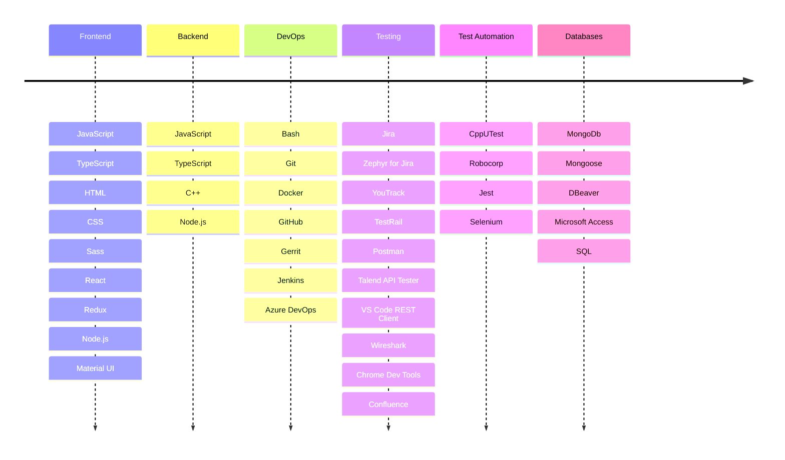

<h3 align="center">
Skills & Tools
</h3>



<!-- For quick copy&paste
```
Frontend: JavaScript, TypeScript, HTML, CSS, Sass, React, Redux, Node.js, Material UI
Backend: C++, JavaScript, TypeScript, Node.js
DevOps: Bash, Git, Docker, GitHub, Gerrit, Jenkins, Azure DevOps
Testing: Jira, Zephyr for Jira, YouTrack, TestRail, Postman, Talend API Tester, VS Code REST Client, Wireshark, Chrome Dev Tools, Confluence
Test Automation: CppUTest, Robocorp, Jest, Selenium
Databases: MongoDb, Mongoose, DBeaver, Microsoft Access, SQL
Other: Markdown, Lodash, Figma, Photoshop, Mermaid, FileMerge, Putty
Basic Knowledge: Python, Java, AWS
SDLC Models: Scrum, Kanban
Operating Systems: Linux, Windows, MacOS, iOS
```
-->

---

<h3 align="center">Here are several examples of my works</h3>

<p align="center">
	NFT Component Card: 
	<a href="https://sonata22.github.io/nft-preview-card-component/" target="_blank">Demo</a> |
	<a href="https://github.com/sonata22/nft-preview-card-component" target="_blank">Repo</a>
	<br>
	Shopping Cart Application:
	<a href="https://bof-frontend-project-advanced-qpdtga5gj-sonata22.vercel.app/" target="_blank">Demo</a> |
	<a href="https://github.com/sonata22/BOF-frontend-advanced-project" target="_blank">Repo</a>
	<br>
	Phonebook Application:
	<a href="https://fullstack-part3-phonebook-piz7.onrender.com/" target="_blank">Demo</a> |
	<a href="https://github.com/sonata22/FullStack_part3?tab=readme-ov-file" target="_blank">Repo</a>
</p>

---

<h3 align="center">Languages</h3>

```
English: Advanced
Ukrainian: 1st Native
Russian: 2nd Native
German: Elementary
Finnish: Beginner
```

---

<h3 align="center">Links</h3>
<p align="center">
	<a href="https://cssbattle.dev/player/sonata22" target="_blank">CSS Battle</a> |
	<a href="https://www.codewars.com/users/sonata22" target="_blank">Codewars</a> |
	<a href="https://codepen.io/sonata22" target="_blank">Codepen</a> |
 	<a href="https://leetcode.com/sonata22/" target="_blank">Leetcode</a>
</p>

---

<h3 align="center">
Contact Me
</h3>

<p align="center">
	LinkedIn: <a href="https://www.linkedin.com/in/nataliia-sosnovshchenko/" target="_blank">sonata22</a>
	<br>
	Email: <a href="mailto:sonata24@proton.me" target="_blank">sonata24@proton.me</a>
</p>
